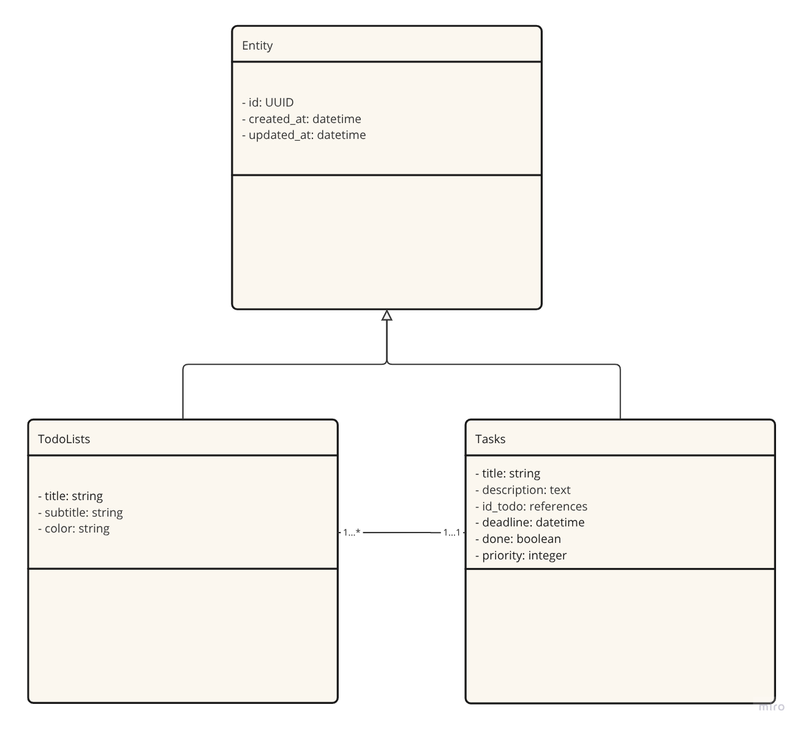

# ✅ TO DO List - API Backend

API desenvolvida em Ruby on Rails para gerenciamento de tarefas e listas, seguindo arquitetura RESTful e boas práticas de organização de código.

---

## 🧩 Diagrama de Classes



---

## 🗃️ Banco de Dados

- Banco: PostgreSQL
- Estrutura baseada em 2 entidades principais:
  - `Todolists` → título, subtítulo, cor
  - `Tasks` → título, descrição, prazo, prioridade, status, vínculo com uma lista

### 🔗 Relacionamento
- Uma **Todolist** possui muitas **Tasks**
- Cada **Task** pertence a uma **Todolist**

---

## 🔌 Endpoints REST

### 📋 Todolists
| Método | Rota                 | Descrição                     |
|--------|----------------------|-------------------------------|
| GET    | `/todolists`         | Listar todas as listas        |
| GET    | `/todolists/:id`     | Buscar uma lista por ID       |
| POST   | `/todolists`         | Criar nova lista              |
| PUT    | `/todolists/:id`     | Atualizar uma lista           |
| DELETE | `/todolists/:id`     | Deletar uma lista             |
| GET    | `/todolists/:id/tasks` | Listar tarefas da lista       |

### 🧾 Tasks
| Método | Rota              | Descrição                     |
|--------|-------------------|-------------------------------|
| GET    | `/tasks`          | Listar todas as tarefas       |
| GET    | `/tasks/:id`      | Buscar uma tarefa por ID      |
| POST   | `/tasks`          | Criar nova tarefa             |
| PUT    | `/tasks/:id`      | Atualizar uma tarefa          |
| DELETE | `/tasks/:id`      | Deletar uma tarefa            |

---

## ⚙️ Tecnologias & Gems

| Tecnologia / Gem             | Função                                               |
|-----------------------------|------------------------------------------------------|
| `rails ~> 8.0.2`             | Framework principal da aplicação                     |
| `rack-cors`                 | Suporte a requisições de diferentes origens (CORS)   |
| `dotenv-rails`              | Gerenciamento de variáveis de ambiente               |
| `active_model_serializers` | Serialização de modelos para JSON                    |
| `rspec-rails`               | Framework de testes                                  |
| `factory_bot_rails`         | Geração de dados falsos para testes                  |

---

## ▶️ Como Rodar o Projeto

```bash
# Instale as dependências
bundle install

# Configure as variáveis de ambiente
cp .env.example .env

# Configure o banco de dados
rails db:create db:migrate

# Rode o servidor local
rails server